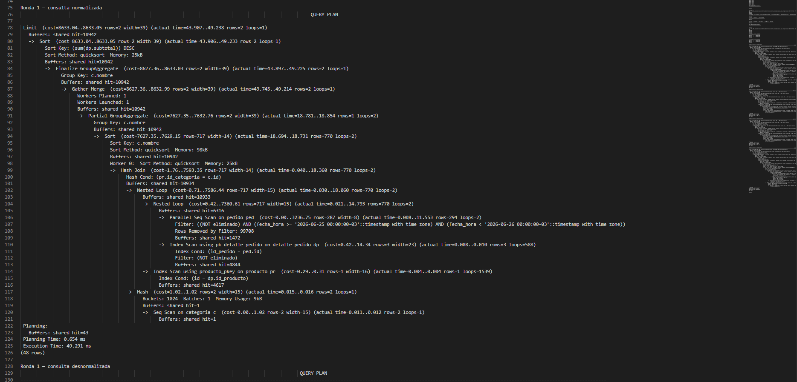
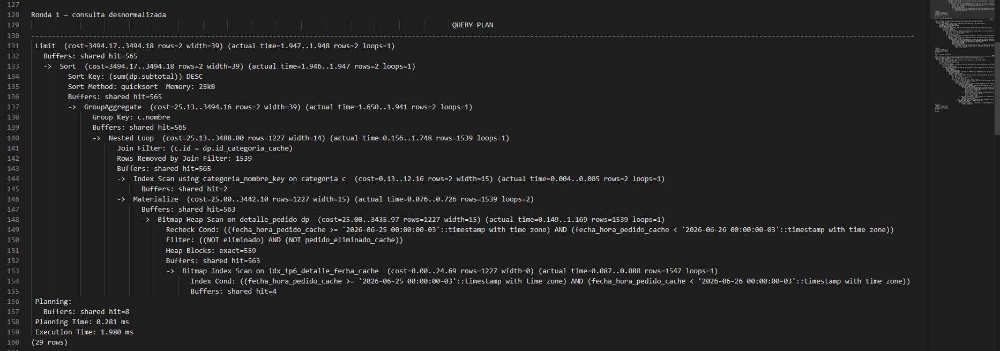
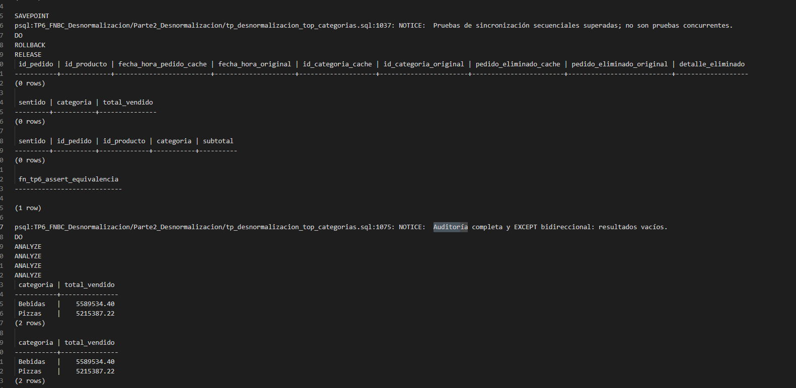

# TP6 — FNBC y desnormalización controlada

## Parte 1 — Normalización del control de lotes

Se analizó **R(L,D,C)**, donde L representa lote, D depósito y C responsable de control, con las dependencias de dominio **LD → C** y **C → D**. Cada responsable pertenece a un único depósito; un depósito puede tener varios responsables. No se infirieron dependencias por coincidencias de la muestra.

Las claves candidatas son **LD y LC**: ambas determinan todos los atributos y son mínimas, porque L⁺ = L, D⁺ = D y C⁺ = CD. Son las únicas claves candidatas, ya que ninguna dependencia permite obtener L y toda clave debe incluirlo. **Todos los atributos son primos**.

La relación cumple **3FN**, porque en C → D el atributo dependiente D es primo, pero viola **FNBC**: C no es superclave. La repetición del depósito del responsable origina anomalías al registrar una pertenencia sin lote, borrar su último control o actualizar solo algunas de sus filas.

Se descompuso en:

- **responsable_deposito(C,D)**, con PK C.
- **control_lote(L,C)**, con PK LC.

Ambas relaciones quedan en FNBC. La reunión es **sin pérdida** porque el atributo común C determina toda responsable_deposito: **C → CD**.

Sin embargo, **LD → C no se preserva mediante las restricciones locales**. Si responsable_deposito contiene (801,30) y (803,30), y control_lote contiene (501,801) y (501,803), las PK y FK se cumplen, pero la reunión asigna dos responsables al mismo lote y depósito. Evitarlo requiere un control entre tablas, no implementado en esta parte. Reunión sin pérdida y preservación de dependencias son propiedades distintas.

El script `tp_fnbc_control_lote.sql` migró mediante `INSERT ... SELECT DISTINCT` y reconstruyó la relación con `v_control_lote_almacen`. La evidencia `evidencia_fnbc_20261008_222128.txt` registra diferencias vacías con EXCEPT bidireccional, conteos **3/2/3/3** y reconstrucción exacta de (501,30,801), (502,30,801) y (503,31,802).

## Parte 2 — Top diario de categorías

### Adaptación y patrón elegido

La consulta conserva `SUM(dp.subtotal)`, agrupación por nombre, orden descendente y `LIMIT 5`, usando `dp.id_pedido`, `dp.id_producto`, `pr.id_categoria` y un intervalo semiabierto sobre `ped.fecha_hora`. Se mide el **2026-06-25 en America/Buenos_Aires**, sustituyendo CURRENT_DATE porque la carga no contiene pedidos de hoy. El ensayo corregido incorpora `pedido.eliminado` y `detalle_pedido.eliminado` como estados propios independientes, ambos BOOLEAN NOT NULL DEFAULT FALSE. La consulta normalizada exige `dp.eliminado = FALSE AND ped.eliminado = FALSE`. No se agregan filtros por estado ni por activo; CANCELADO no representa borrado lógico.

La copia contiene **200005 pedidos, 499571 detalles, 50003 productos y 2 categorías**. El resultado tiene como máximo dos filas; no representa un top cinco entre muchas categorías.

Se eligieron columnas precalculadas con disparadores porque el plan inicial histórico mostró un recorrido paralelo de pedido y 1539 búsquedas en producto, con 4617 buffers; copiar al detalle los atributos de consulta permite evitar esos recorridos y sincronizar los cambios dentro de la misma transacción, sin esperar un refresco periódico. Una vista materializada actualizada de noche no satisface el requisito de actualización frecuente. Retirar las copias y sus mecanismos permitiría volver a la consulta normalizada conservando ambos atributos propios de borrado lógico.

### Implementación y rendimiento

`tp_desnormalizacion_top_categorias.sql` agrega `fecha_hora_pedido_cache`, `id_categoria_cache` y `pedido_eliminado_cache`, sus restricciones y el índice de fecha existente `idx_tp6_detalle_fecha_cache`. Un trigger recalcula las tres copias al insertar o actualizar detalles, incluso al cambiar el pedido asociado o escribir un cache arbitrario. Los otros propagan cambios de fecha o eliminado del pedido y categoría del producto, conservando sus nombres. `pedido_eliminado_cache` copia exclusivamente `pedido.eliminado`; ningún trigger deriva el estado propio del detalle desde su pedido. Restaurar el pedido no restaura detalles eliminados individualmente, y restaurar un detalle bajo un pedido eliminado tampoco lo vuelve visible.

La consulta desnormalizada exige `dp.eliminado = FALSE AND dp.pedido_eliminado_cache = FALSE`, sin unir nuevamente pedido ni producto. El nombre se obtiene mediante JOIN con categoria y no se copia.

La medición inicial corregida está en [evidencia_top_antes_logico_20261009_092704.txt](Parte2_Desnormalizacion/evidencias/evidencia_top_antes_logico_20261009_092704.txt): **62.538 ms**, shared hit=8455 y ROLLBACK final. Es una referencia previa a las copias; no se utiliza para calcular la mejora entre rondas. La comparación corregida está en [evidencia_top_desnormalizacion_logico_20261009_092837.txt](Parte2_Desnormalizacion/evidencias/evidencia_top_desnormalizacion_logico_20261009_092837.txt):

| Medición corregida | Normalizada (ms) | Desnormalizada (ms) |
|---|---:|---:|
| Ronda 1 | 49.291 | 1.980 |
| Ronda 2 | 47.556 | 1.323 |
| Promedio | 48.4235 | 1.6515 |

| Métrica — ensayo corregido | Antes: normalizada | Después: desnormalizada |
|---|---|---|
| Tiempo promedio | 48.4235 ms | 1.6515 ms |
| shared hit, en ambas rondas | 10942 | 565 |
| Nodos principales | Parallel Seq Scan de pedido; Nested Loop con búsquedas en detalle y producto | Bitmap Index Scan del índice de fecha; Bitmap Heap Scan de detalle; Nested Loop con categoria |

La reducción temporal es **96.59 %**, calculada como `(48.4235 - 1.6515) / 48.4235 * 100`; el cociente normalizada/desnormalizada es **29.32**, calculado como `48.4235 / 1.6515`. Corresponde al **conjunto columnas más índice**, sin separar el aporte de cada componente. Los shared hit son accesos resueltos en caché, no lecturas físicas ni páginas únicas; su reducción es **94.84 %**.

La normalizada recorre pedido con su filtro lógico y busca detalles y productos. La desnormalizada obtiene 1539 detalles visibles por fecha y filtros `NOT eliminado AND NOT pedido_eliminado_cache`, accediendo a 559 bloques de tabla. Mantiene únicamente el JOIN con categoria. El nodo Materialize es un nodo de ejecución, no una vista materializada.

Capturas del ensayo corregido — 09/10/2026:

Plan normalizado con filtros de borrado lógico: **49.291 ms**, **shared hit=10942**.

Plan desnormalizado con ambos filtros lógicos: **1.980 ms**, **shared hit=565**.

Pruebas secuenciales superadas; auditoría, diferencias del top y EXCEPT ALL de filas vacíos. El **ROLLBACK** visible en esta captura corresponde a **ROLLBACK TO SAVEPOINT**, que descarta las filas de prueba. El **ROLLBACK final** de la transacción está registrado en el [TXT completo del ensayo corregido](Parte2_Desnormalizacion/evidencias/evidencia_top_desnormalizacion_logico_20261009_092837.txt).

### Antecedentes históricos sin filtros de borrado lógico — 08/10/2026

La medición inicial histórica de **47.151 ms** está en [evidencia_top_antes_20261008_225517.txt](Parte2_Desnormalizacion/evidencias/evidencia_top_antes_20261008_225517.txt). La comparación histórica está en [evidencia_top_desnormalizacion_20261008_232126.txt](Parte2_Desnormalizacion/evidencias/evidencia_top_desnormalizacion_20261008_232126.txt):

| Medición | Normalizada (ms) | Desnormalizada (ms) |
|---|---:|---:|
| Ronda 1 | 42.807 | 1.855 |
| Ronda 2 | 41.920 | 1.815 |
| Promedio | 42.3635 | 1.835 |

| Antes: normalizada | Después: desnormalizada |
|---|---|
| Promedio: 42.3635 ms | Promedio: 1.835 ms |
| shared hit: 10942 | shared hit: 564 |
| Parallel Seq Scan de pedido y Nested Loop con búsquedas en detalle/producto | Bitmap Heap Scan de detalle mediante el índice de fecha y Nested Loop con categoria |

La reducción histórica fue **95.67 %**, con cociente **23.09** y shared hit de 10942/564. Los 47.151 ms iniciales no intervinieron en ese cálculo. Estos resultados corresponden a la versión sin filtros y se conservan como antecedentes; no se mezclan con las rondas corregidas.

Las siguientes capturas anteriores se conservan como antecedentes de la versión sin filtros:

### Validación y límites

Ambas consultas corregidas devolvieron **Bebidas: 5589534.40** y **Pizzas: 5215387.22**. La auditoría inicial y posterior, el EXCEPT bidireccional del top y el EXCEPT ALL bidireccional de filas participantes devolvieron cero filas. La auditoría compara las tres copias con sus fuentes y examina también registros eliminados, sin limitarse al día.

Las pruebas secuenciales fueron superadas: cuatro combinaciones lógicas; restauraciones independientes; inserción bajo pedido eliminado; traslado del detalle a un pedido vigente y retorno, con participación o ausencia en ambas consultas de filas; cambio simultáneo de fecha y eliminado; corrección de cache arbitrario y propagación a varios detalles, incluidos los eliminados individualmente. Se conservaron los casos de montos, categoría, cambio de padres, nombre, DELETE y CASCADE. Los fixtures usaron IDs negativos explícitos sin consumir secuencias y se deshicieron mediante ROLLBACK TO SAVEPOINT antes de ANALYZE y las mediciones. Las aserciones de auditoría, top y EXCEPT ALL se repitieron después de deshacerlos.

Ambos ensayos corregidos de Parte 2 terminaron con **ROLLBACK**, registrado en las evidencias. Según el control posterior informado por el grupo, quedaron **cero columnas añadidas** y se conservaron **200005 pedidos y 499571 detalles**. Ese control posterior no está incluido en los dos TXT citados.

La sincronización soporta **READ COMMITTED**, utiliza bloqueos FOR SHARE sobre los padres y puede generar interbloqueos que requieran reintentar la transacción completa. **La concurrencia entre sesiones no fue probada.**

El cambio aumenta el tamaño de las filas y el trabajo de escritura, mantenimiento del índice y propagación a múltiples detalles; ese costo no fue cuantificado. Las mediciones se realizaron después de cargar e indexar, dentro de la misma transacción, con ANALYZE, calentamiento previo y orden alternado. Los bloqueos ACCESS EXCLUSIVE impidieron actividad concurrente; no hubo VACUUM y dos rondas no constituyen un benchmark exhaustivo.

## Alcance y referencias

Los fundamentos y resultados detallados están en `informe_parte1_fnbc.md` e `informe_parte2_desnormalizacion.md`, dentro de `TP6_FNBC_Desnormalizacion`.

El [PDF actual](informe_final_tp6.pdf) corresponde al **ensayo corregido con borrado lógico** e incorpora sus resultados y capturas.

**Ambos scripts de implementación terminan con ROLLBACK**, confirmado en sus evidencias: ni la migración de Parte 1 ni la instalación de Parte 2 quedaron persistidas.
