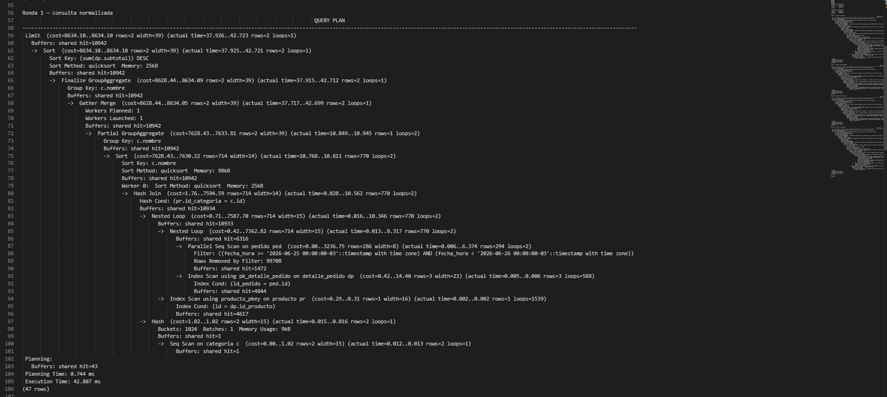
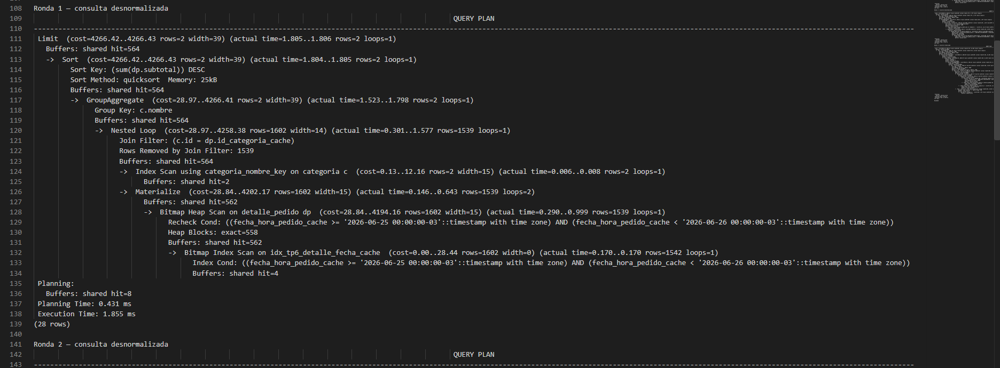
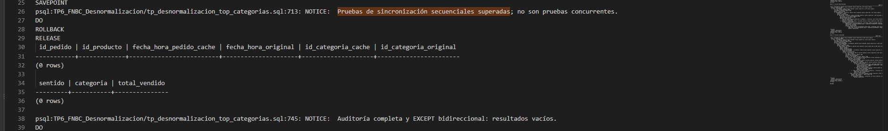

# TP6 — FNBC y desnormalización controlada

## Parte 1 — Normalización del control de lotes

Se analizó **R(L,D,C)**, donde L representa lote, D depósito y C responsable de control, con las dependencias de dominio **LD → C** y **C → D**. Cada responsable pertenece a un único depósito; un depósito puede tener varios responsables. No se infirieron dependencias por coincidencias de la muestra.

Las claves candidatas son **LD y LC**: ambas determinan todos los atributos y son mínimas, porque L⁺ = L, D⁺ = D y C⁺ = CD. Son las únicas claves candidatas, ya que ninguna dependencia permite obtener L y toda clave debe incluirlo. **Todos los atributos son primos**.

La relación cumple **3FN**, porque en C → D el atributo dependiente D es primo, pero viola **FNBC**: C no es superclave. La repetición del depósito del responsable origina anomalías al registrar una pertenencia sin lote, borrar su último control o actualizar solo algunas de sus filas.

Se descompuso en:

- **responsable_deposito(C,D)**, con PK C.
- **control_lote(L,C)**, con PK LC.

Ambas relaciones quedan en FNBC. La reunión es **sin pérdida** porque el atributo común C determina toda responsable_deposito: **C → CD**.

Sin embargo, **LD → C no se preserva mediante las restricciones locales**. Si responsable_deposito contiene (801,30) y (803,30), y control_lote contiene (501,801) y (501,803), las PK y FK se cumplen, pero la reunión asigna dos responsables al mismo lote y depósito. Evitarlo requiere un control entre tablas, no implementado en esta parte. Reunión sin pérdida y preservación de dependencias son propiedades distintas.

El script `tp_fnbc_control_lote.sql` migró mediante `INSERT ... SELECT DISTINCT` y reconstruyó la relación con `v_control_lote_almacen`. La evidencia `evidencia_fnbc_20261008_222128.txt` registra diferencias vacías con EXCEPT bidireccional, conteos **3/2/3/3** y reconstrucción exacta de (501,30,801), (502,30,801) y (503,31,802).

## Parte 2 — Top diario de categorías

### Adaptación y patrón elegido

La consulta conserva `SUM(dp.subtotal)`, agrupación por nombre y `LIMIT 5`, usando `dp.id_pedido`, `dp.id_producto`, `pr.id_categoria` y un intervalo semiabierto sobre `ped.fecha_hora`. Se mide el **2026-06-25 en America/Buenos_Aires**, sustituyendo CURRENT_DATE porque la carga no contiene pedidos de hoy. Se omiten los filtros eliminado, inexistentes en pedido y detalle_pedido, sin agregar filtros por estado o activo.

La copia contiene **200005 pedidos, 499571 detalles, 50003 productos y 2 categorías**. El resultado tiene como máximo dos filas; no representa un top cinco entre muchas categorías.

Se eligieron columnas precalculadas con disparadores porque la medición inicial de **47.151 ms** mostró un recorrido paralelo de pedido y 1539 búsquedas en producto, con 4617 buffers; copiar al detalle la fecha y la categoría permite evitar esos recorridos y sincronizar los cambios dentro de la misma transacción, sin esperar un refresco periódico. Una vista materializada actualizada de noche no satisface el requisito de actualización frecuente. La adaptación es reversible porque conserva las fuentes originales y permite retirar únicamente los objetos añadidos.

### Implementación y rendimiento

`tp_desnormalizacion_top_categorias.sql` agrega `fecha_hora_pedido_cache` e `id_categoria_cache`, sus restricciones y el índice `idx_tp6_detalle_fecha_cache`. Un trigger recalcula ambas copias al insertar o actualizar detalles; otros propagan cambios de fecha del pedido y categoría del producto. El nombre se obtiene mediante JOIN con categoria y no se copia.

La medición inicial está en `evidencia_top_antes_20261008_225517.txt`, obtenida con `medir_top_categorias_antes.sql`. La comparación directa está en `evidencia_top_desnormalizacion_20261008_232126.txt`:

| Medición | Normalizada (ms) | Desnormalizada (ms) |
|---|---:|---:|
| Ronda 1 | 42.807 | 1.855 |
| Ronda 2 | 41.920 | 1.815 |
| Promedio | 42.3635 | 1.835 |

| Antes: normalizada | Después: desnormalizada |
|---|---|
| Promedio: 42.3635 ms | Promedio: 1.835 ms |
| shared hit: 10942 | shared hit: 564 |
| Parallel Seq Scan de pedido y Nested Loop con búsquedas en detalle/producto | Bitmap Heap Scan de detalle mediante el índice de fecha y Nested Loop con categoria |

La reducción observada del tiempo es **95.67 %**, con un cociente de tiempos de **23.09**, atribuible al **conjunto columnas más índice**. No se usaron los 47.151 ms iniciales para calcularla. Los buffers shared hit son accesos resueltos en caché, no lecturas físicas ni páginas únicas.

La consulta normalizada recorre pedido y busca detalles y productos. La desnormalizada accede por fecha a los 1539 detalles visibles y conserva únicamente el JOIN con categoria.

### Validación y límites

Ambas consultas devolvieron **Bebidas: 5589534.40** y **Pizzas: 5215387.22**. El EXCEPT bidireccional y la auditoría completa de las columnas redundantes devolvieron cero filas.

Las pruebas secuenciales verificaron INSERT, UPDATE, cambios de padres, propagación de fecha y categoría, cambio de nombre, DELETE y CASCADE. Usaron IDs explícitos sin consumir secuencias y se deshicieron con SAVEPOINT antes de medir.

La sincronización soporta **READ COMMITTED**, utiliza bloqueos FOR SHARE sobre los padres y puede generar interbloqueos que requieran reintentar la transacción completa. **La concurrencia entre sesiones no fue probada.**

El cambio aumenta el tamaño de las filas y el trabajo de escritura, mantenimiento del índice y propagación a múltiples detalles; ese costo no fue cuantificado. Las mediciones se realizaron después de cargar e indexar, dentro de la misma transacción, con ANALYZE, calentamiento previo y orden alternado. Los bloqueos ACCESS EXCLUSIVE impidieron actividad concurrente; no hubo VACUUM y dos rondas no constituyen un benchmark exhaustivo.

## Alcance y referencias

Los fundamentos y resultados detallados están en `informe_parte1_fnbc.md` e `informe_parte2_desnormalizacion.md`, dentro de `TP6_FNBC_Desnormalizacion`.

**Ambos scripts de implementación terminan con ROLLBACK**, confirmado en sus evidencias: ni la migración de Parte 1 ni la instalación de Parte 2 quedaron persistidas.
